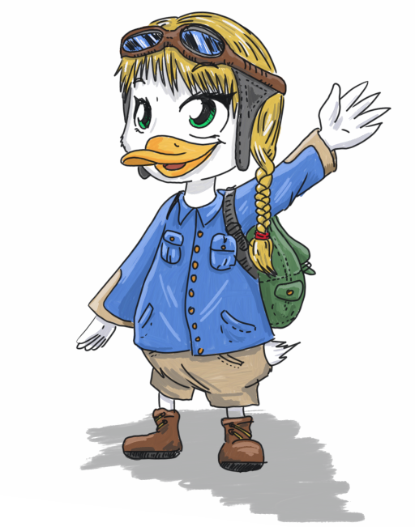
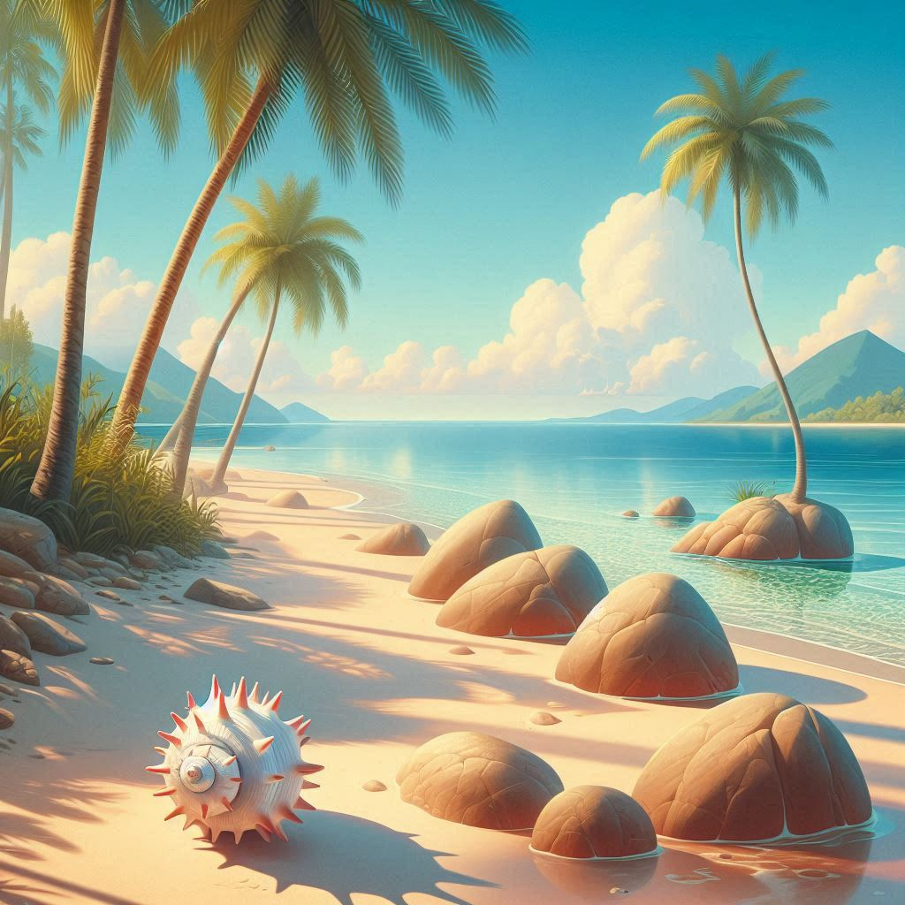
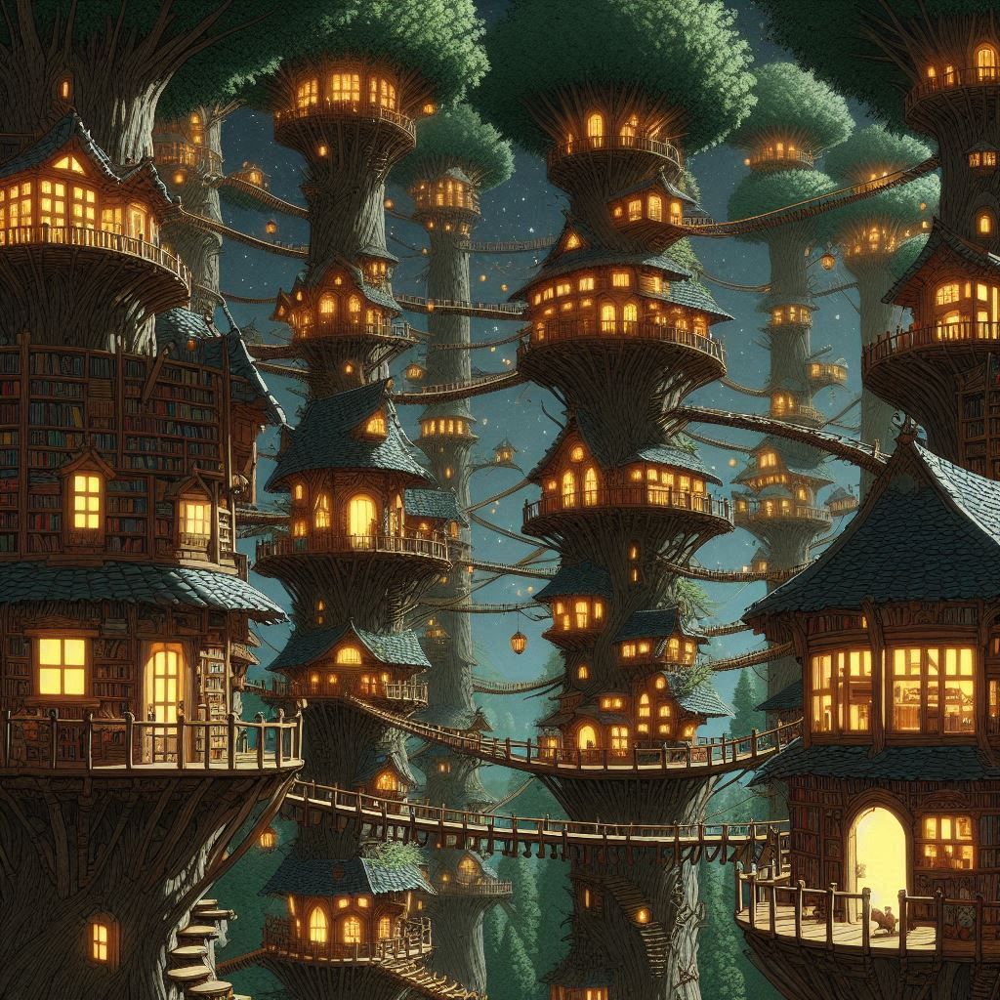
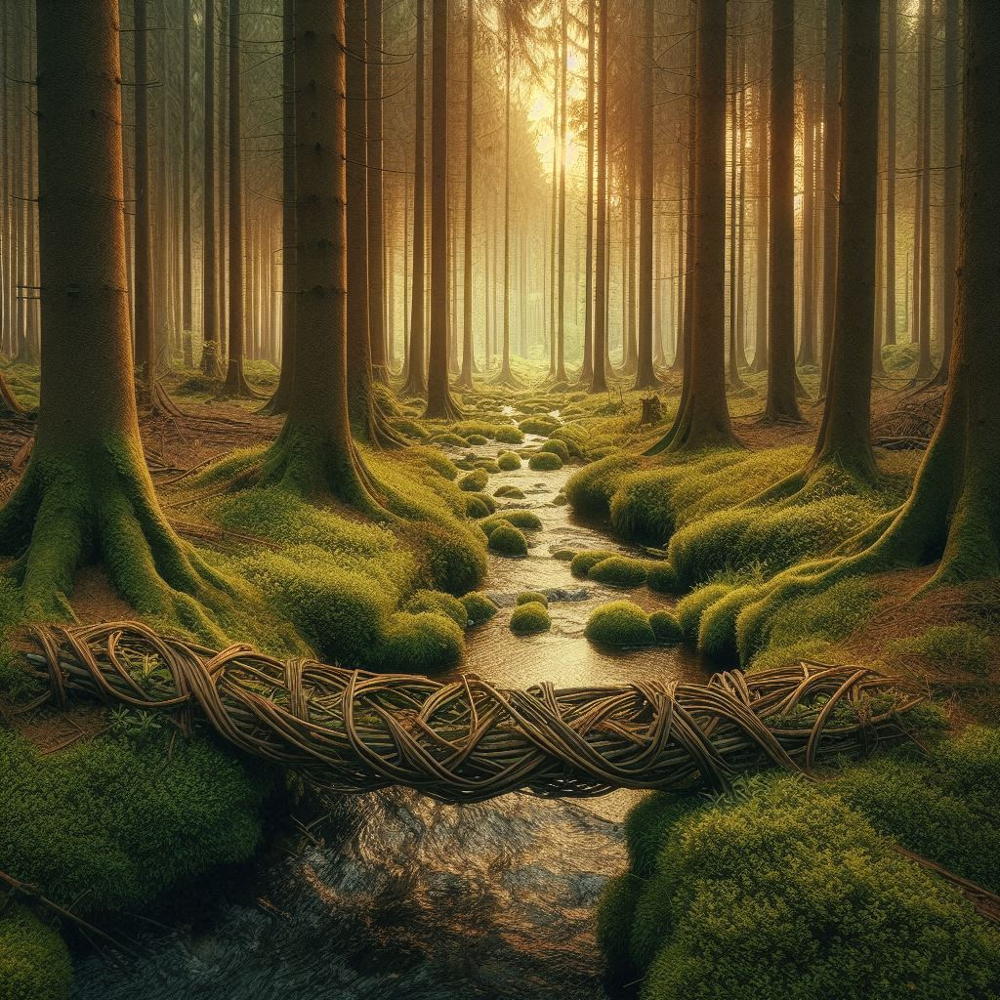

---
ebook:
  theme: github-light.css
  title: Kiki die kleine Ente
  authors: Georg Eckert
---

# Kiki die kleine Ente

> Kiki die kleine Ente © 2024 by Georg Eckert is licensed under CC BY-NC-ND 4.0. To view a copy of this license, visit https://creativecommons.org/licenses/by-nc-nd/4.0/

+ [Wie Kiki auf die Welt kam](#wie-kiki-auf-die-welt-kam)
+ [Wie Kiki die Kröten kennen lernte](#wie-kiki-die-kröten-kennen-lernte)
+ [Wie Kiki dem kleinen Krebs half sein Haus wiederzufinden](#wie-kiki-dem-kleinen-krebs-half-sein-haus-wiederzufinden)
+ [Die bunten Hühner](#die-bunten-hühner)
+ [Der weiße Flamingo](#der-weiße-flamingo)
+ [Die Stadt der Mäuse](#die-stadt-der-mäuse)
+ [Wie Kiki den Ameisen half](#wie-kiki-den-ameisen-half)

## Wie Kiki auf die Welt kam

An einem Teich, garnicht weit von hier, standen viele kleine Häuschen. Von jedem führte ein Steg ins Wasser.
Sonst sahen sie sich aber nicht ähnlich. Eines der Häuschen sah aus, wie ein krummer Leuchtturm aus altem
Holz. Ein anderes war ein Fass und wieder ein anderes hatte die Form eines Zeltes. Eines hatten aber alle
Häuschen gemein. Es wohnten Enten darin. Alte Enten, junge Enten, kleine Enten, große Enten. Es gab Häuser
in denen wohnten viele Enten und solche, da wohnte nur eine Ente. Mal lebten dort Mama- und Papa-Enten mit
ihren Kindern. Dann wieder zwei Mama-Enten oder zwei Papa-Enten mit ihren Kindern.
Ganz am Ende des Teichs, dort wo ein kleiner Bach in den Teich mündete, stand zwischen Schilf und
Rohrputzern ein kleines, schlichtes Haus. Blumen standen davor und eine runde Tür führte ins Innere.
Davor saßen eine Mama- und eine Papa-Ente aneinander geschmiegt und sahen sich den Sonnenuntergang an.
Es wurde jetzt ruhiger. Die meisten Enten gingen zu Bett und auch das Geschnatter der kleinen Enten-Kinder
verstummte jetzt.
Die Sonne war untergegangen und es wurde langsam kühler. Unsere Mama-Ente kuschelte sich noch enger an
ihren Enterich und er flüsterte ihr zu: "So gern hätte ich auch ein kleines Entlein." Mama-Ente nickte und
beide hielten sich an den Händen, schauten auf ihren Lieblingsstern und kniffen die Augen zu. Dann wünschten
sie sich ganz innig ein kleines Entenkind. Mama-Ente seufzte und ging zu Bett. Auch Papa-Ente ging schlafen.
Als beide fest eingeschlafen waren, fing ihr Lieblingsstern an, heller und heller zu leuchten und zu funkeln.
Dann fing er an zu zittern und hin und her zu wackeln und schließlich fiel er vom Himmel herab. Schneller
und schneller fiel er in Richtung des kleinen Teichs, wo die zwei Enten lebten und als er auf das Haus prallte,
zerstob er ein tausende Funken, welche kurz darauf verglühten. Dann war es wieder dunkel.
Am nächsten Morgen gähnte Mama-Ente und murmelte: "Mach doch mal Platz. Ich habe ja gar keinen Platz."
"Ich fall gleich aus dem Bett", sagte Papa-Ente. Und plumps, schon lag er am Boden. Beide setzen sich auf
und rieben sich ungläubig die Augen. "Was ist denn das?", fragte Papa-Ente. Auch Mama-Ente wusste keine
Antwort. Da lag zwischen ihnen im Bett ein großes Enten-Ei. Es hatte grüne und weiße Streifen und dazwischen
waren goldene und silberne Dreiecke und Sterne.
Sie konnten es nicht in Wort fassen. Aber beide Enten wussten, dass dieses Ei ein Geschenk des Himmels war - das Entenkind das sich beide gewünscht hatten.
Mama-Ente saß jetzt von früh bis spät auf dem Ei und hielt es warm. Papa war unterwegs, um Essen zu sammeln
und ein Kinderbett zu bauen. Nach ein paar Tagen fing das Ei an, hin und wieder zu wackeln. Die beiden Enten
waren ganz aufgeregt. Einen Tag später hörten sie ein Kratzen im Innern des Eis. Und noch einen Tag später
hörten sie schließlich ein Picken und Kratzen, das Ei wackelte und bekam Risse und dann - dann schaute eine
kleine gelbe Schnabelspitze aus einem der Risse heraus. Nun riss die obere Hälfte der Schale an und ein
kleines wuscheliges Enten-Baby saß dort in der Schale, ein Stückchen davon noch wie ein Hut auf dem Kopf.
Es schaute zu Mama und zu Papa, machte große Augen, sperrte den Schnabel auf und fing an zu lachen.
"Kikihihi, kikihihi", lachte es und Mama und Papa strahlten vor Freude. "Hast du das gehört? Lass uns die
kleine 'Kiki' nennen", sagte Mama-Ente und Papa stimmte ihr zu. Am Abend saßen die drei zusammengekuschelt
vor ihrem Entenhäuschen. Sie waren so glücklich wie noch nie. Dabei fiel ihnen garnicht auf, dass ihr
Lieblingsstern nicht mehr am Himmel zu sehen war.

## Wie Kiki die Kröten kennen lernte

Heute erzähle ich euch eine Geschichte davon, was Kiki - unsere kleine Ente - als Kind erlebt hat. Sie lebte mit Mama und Papa am Ententeich. Die drei hatten ein kleines Entenhaus mit einem Steg, von dem aus man in den See hüpfen konnte. Um den See herum standen noch viele andere Entenhäuser, in denen auch Familien, Entenomas und -Opas, Onkels und Tanten, junge und alte Enten wohnten. Vorn am Teich war ein Biberdamm, in dem die Biber wohnten. Auf der anderen Seite mündete ein Bach in den Teich. Hier standen einige tote Bäume, auf denen große Nester ruhten. Tagsüber ging Kiki in den Kindergarten, zusammen mit anderen Tierkindern. Da waren noch Schwanen- und Gänseküken, schwarze und weiße Storchenküken, Biber- und Bisamrattenkinder. 

Nach dem Kindergarten spielten hüpften die Tierkinder meist von den Stegen und spielten im Wasser. Aber heute waren keine Kinder da. Die älteren Tierkinder sahen sich mit ihren Eltern die Teichschule an, in die sie bald gehen würden. Die Jüngeren begleiteten ihre Geschwister und so war Kiki heute das erste Mal allein am Teich. "Ist das langweilig", maulte sie, "was soll ich den jetzt nur alleine tun?" Sie dachte eine Weile nach und ließ den Blick über den See schweifen. "Dort hinten bei den Storechennestern war ich noch nie", dachte sie sich. Dann hüpfte sie ins Wasser und schwamm in Richtung Bachmündung. Schwimmen konnte Kiki sehr gut. Das können Enten schon ganz früh. Es war noch nicht lange her, dass Kiki sich nur mit Mama und Papa zusammen ins Wasser getraut hatte. Doch jetzt sprang sie bei jeder Gelegenheit hinein und planschte und tauchte so viel sie konnte. "Dort ist das Haus der Bisamratten. Da war ich schon", dachte sie, als sie um die letzte kleine Sandbank des Teichs schwamm. Dahinter wuchs dichtes Schilf und dazwischen mündete der Silberbach in den Teich. "Ob ich noch weiter schwimmen kann", fragte sich die kleine Ente. Doch schon war sie an den alten Bäumen vorbei in den Bach geschwommen. Da hört sie ein merkwürdiges Geräusch: "Quaaaak. Ribbit. Quaaaaak." "Was ist denn das", fragte sich Kiki. Dann schwamm sie mitten in das Schilf hinein. Dort saß, auf einem großen Seerosenblatt eine große braune Kröte. Kröten kannte Kiki nur aus dem Bilderbuch. Dann wurde der Hals der Kröte immer dicker und dicker. Und da war es wieder: "Quaaaaaak. Ribbit. Quaaaak" "Ach du bist das", rief Kiki, "toll klingt das!" "Die Kröte beachtete die kleine Ente nicht weiter drehte sich auf dem Blatt und hüpfte auf das nächste um weiter zu quaken. "Warte mal", rief Kiki, "du bis eine Kröte, oder? Ich bin die Kiki und wie heißt du?" Langsam drehte sich die Kröte wieder um: "Karl heiße ich. Und jetzt machs gut." Dann schickte sich Karl die Kröte an, weiter zu hüpfen. "Warum quakst du denn so laut", fragte Kiki neugierig. Die Kröte seufzte: "Brauche ich denn einen Grund? Wann immer mir danach ist, quake ich." Dann drehte sich die Kröte wieder um. "Das will ich auch probieren - Kwaaaak", machte Kiki und hüpfte auf eins der Blätter. "Naja, für den Anfang nicht schlecht", sagte die Kröte und musste jetzt ein bisschen schmunzeln, als Kiki tief in die Hocke ging und auf das nächste Blatt sprang: "Mein Kind, nicht alle Tiere mögen es, wenn man sie nachahmt." "Aber wie soll ich denn sonst etwas neues lernen? Es sah so toll aus, wie du da von Blatt zu Blatt gehüpft bist. Das will ich auch können." "Na von mir aus", erbarmte sich der Frosch und hüpfte auf ein Blatt neben Kiki. "Dann pass jetzt gut auf, wie hoch ich springen kann!" Mit einem großen Satz sprang Karl die Kröte auf einen alten Baumstumpf am Ufer. "Hast du denn gar keine Angst vor den Störchen", fragte Kiki besorgt. "Ach, die kennen mich schon und lassen mich in Ruhe. Die essen viel lieber Insekten und Schnecken", beruhigte die Kröte sie. "Jetzt muss ich aber wirklich los. Die Kröten treffen sich zum abendlichen Konzert und ich bin der erste Tenor, das heißt, dass die anderen Kröten ohne mich aus dem Takt geraten. Wenn du willst, kannst du ja mitkommen."

Das ließ Kiki sich nicht zweimal sagen und folgte der Kröte ans Ufer, wo auf mehreren Steinen verteilt die Kröten saßen. Braune, grüne und schwarze Kröten saßen da. Als sich Karl auf den großen Stein in der Mitte gesetzt hatte, begann er sogleich sein schönstes "Quaak, Ribbit, Quaak" von sich zu geben und die anderen Kröten stimmten kurz darauf ein. Die großen Kröten ganz unten brummten ihr "Quaaak, Quaaak, Quak, Quak". Die kleinen ganz oben ihr "Ribbitit, Ribbitit". Kiki lauschte diesem Konzert mit großen Augen und offenem Schnabel. Als die Kröten wieder verstummten fing sie an zu klatschen. "Bravo, Bravo", rief sie. Die Kröten sahen sie verwundert an. "Nanu? Karl, hast du eine Zuhörerin mitgebracht", fragte eine große schwarze Kröte. "Oh wie schön war das", rief Kiki aus. "Warum ist denn niemand außer mir hier?" "Du bist noch klein, mein Kind", sagte Karl, "du weißt noch nicht, wie garstig die Welt zu kleinen Tieren wie uns sein kann. Mich lassen die Störche zwar in Ruhe, aber meine Freunde hier haben nicht so großes Glück", erklärte er. "Schau nur hier. Da hat mir der alte schwarze Storch - ich glaube Heribert heißt er - ins Bein gezwickt." Die Kröte zeigte ein dick angeschwollenes Bein. "Sowas", empörte sich unsere kleine Ente. "Wenn die anderen wüssten, wie schön ihr singt, dann wärt ihr sicher und keiner würde euch was zu leide tun", war Kiki sich sicher. "Wie willst du das wissen", fragte Karl. "Sollen wir ein Konzert vor den Störchen geben und wenn es ihnen nicht gefällt, dann gibt es im Anschluss gleich noch Abendessen mit uns als Hauptgericht? Nein Danke", sagte er bestimmt. Kiki grübelte eine Weile. "Ich habe da eine Idee", rief sie dann. Sie rief die Frösche um sich und erklärte ihren Plan. Die Kröten nickten: "Ja, so könnte es vielleicht gehen", sagte einer und "Wir sollten es zumindest probieren", stimmte ein anderer zu. Dann sprangen sie auseinander und Kiki schwamm nach Hause, wo sie Mama und Papa in ihren Plan einweihte.

Am nächsten Abend hatten Mama und Papa sich mit den anderen Eltern des Kindergartens zu einem Picknick verabredet. Die Störche waren auch gekommen. Vor einem großen hohlen Baum standen viele große Pilze auf denen man wunderbar sitzen konnte. Andere ließen sich als Tische benutzen. Gerade als sich alle hingesetzt hatten, um mit dem Essen zu beginnen, hörten sie es: "Quaaaak, Ribbit, Quaaaak". Der alte schwarze Storch reckte den Hals in die Höhe und wurde ganz aufmerksam. Dann stand er auf und lief um den alten Baum herum. Die Kröten begannen ihr Konzert. Alle Tiere lauschten und vergaßen dabei das Essen. Als die Kröten ihr Lied beendet hatten sprangen sie auf und klatschten. Sogar die Störche waren beeindruckt vom Gesang der Kröten. Der alte Storch war ganz gerührt. "Kommt heraus, ich habe euch gefunden", rief er in den hohlen Baum hinein. "Ich verspreche euch, dass kein Storch hier am Teich euch etwas tun wird." Karl die Kröte kannte den alten Storch und vertraute seinem Wort. Als er die anderen Kröten überzeugt hatte, kamen sie alle aus dem Baum gesprungen. Noch einmal applaudierten die Tiere voller Bewunderung. Die Kröten verneigten sich. Der alte Storch neigte sich zu der Kröte mit dem verletzten Bein: "Verzeih' mir. Von nun an sollt ihr ohne Angst mit uns hier am Teich leben", versprach er und rupfte sich eine Feder aus. Sie war rot und leuchtete in der Abenddämmerung glutrot. "Diese Feder schenke ich euch. Solange ihr sie besitzt wird den Kröten an diesem Teich kein Storch etwas zu Leide tun."

Seither versammeln sich die Tiere einmal in der Woche am alten hohlen Baum um dem Konzert der Kröten zu lauschen.

Und das war die Geschichte, wie Kiki unsere kleine Ente Karl die Kröte und seinen Krötenchor kennen gelernt hat.

## Wie Kiki dem kleinen Krebs half sein Haus wiederzufinden

Kiki die kleine Ente, Igor der Igel und Tammy die Taube waren jetzt schon seit zwei Wochen am Strand. Bald würden sie weiter reisen müssen. Doch noch musste sich Kiki erholen und so beschlossen die Freunde, noch ein paar Tage zu bleiben. Sie übten Schwimmen mit Igor und spielten Ball. Dabei mussten sie vorsichtig sein. Igors Stacheln machten mit jedem Ball kurzen Prozess, wenn er nicht achtgab. Gerade als er den Ball zu Kiki warf, flitzte etwas rotes vorbei. Ganz verdutzt hielt er den Ball fest und schaute sich um. Da war es wieder! Jetzt war es in die andere Richtung vorbei gehuscht. Jetzt erkannten sie, was da hin und her rannte. Ein kleiner roter Krebs huschte von einer Seite auf die andere, dann nach vorn zum Meer und dann wieder nach hinten zu den Palmen. Immer wenn er vorbei rannte, hörten sie ihn murmeln: "Wo ist es nur? Wo habe ich es nur verloren?" Und so flitzte der kleine Krebs hin und her und vor und zurück.

"He, du! Warte mal!", rief Kiki ihm zu. Der kleine Krebs bleib zwischen den dreien stehen und sah sich nervös um. "Was willst du denn von mir? Ich muss weiter suchen!", sagte er ungeduldig. "Aber kleiner Krebs, was suchst du denn?", fragte Kiki neugierig. Auch Tammy und Igor waren dazu gekommen. "Mein Haus! Mein schönes Haus suche ich!", rief der kleine Krebs ganz aufgeregt. "Den halben Strand habe ich schon abgesucht! Was soll ich nur machen, wenn ich mein Haus bis zum Abend nicht gefunden habe? Wo soll ich denn nur schlafen?", rief er verzweifelt. "Aber kleiner Krebs, wir können dir doch beim Suchen helfen!", rief Kiki und ihre Freunde stimmten ihr zu. "Wir zwei können den Strand von oben absuchen und Igor hilft dir hier unten", warf Tammy ein, "Wir haben Zeit und helfen dir gern." "Das würde ihr für mich tun?", fragte der kleine Krebs ganz ungläubig. "Ja sehr gern", rief Kiki. "Wir haben sowieso nicht anderes vor und Ball gespielt haben wir für heute genug", erklärte sie. "Was ist denn das für ein Haus? EIn Haus kann man doch nicht einfach so verlieren", fragte Igor den kleinen Krebs. "Wisst ihr, ich bin ein Einsiedlerkrebs. Ich trage mein Haus immer mit mir herum und wenn ich müde bin, dann krabble ich einfach rückwärts in mein Haus und kann schlafen", antwortete dieser. "Das ist ja praktisch", staunte Kiki und ergänzte: "Jetzt musst du uns nur noch sagen, wie wir dein Haus erkennen können." "Oh, das ist einfach", erklärte der Krebs, "mein Haus ist eine wunderschöne, gedrehte Muschel. Sie ist weiß mit roten Spitzen und wenn ihr ein Ohr daran haltet, dann rauscht sie wie das Meer an einem Regentag." "Das finden wir bestimmt!", riefen die drei Freunde.

Also teilten sich die vier auf. Kiki die kleine Ente und Tammy die Taube flogen davon, um den Strand von oben abzusuchen. Igor und der kleine Krebs teilten den Strand auf. Der kleine Krebs seufzte. Er war noch nicht davon überzeugt, dass es so einfach sein würde. Kiki flog den Strand in weiten Bögen ab. Wann immer sie eine gedrehte Muschel entdeckte, landete sie und sah sie sich genauer an. "Das ist zwar eine schöne gedrehte Muschel, aber die Spitzen sind Gelb." Enttäuscht schüttelte sie den Kopf und stieg wieder in die Luft. Auch Tammy hatte wenig Glück. Sie war schon bei der dritten Muschel gelandet und hielt ihr Ohr daran. "Hm. Weiß ist sie und hat rote Spitzen. Aber diese hier klingt wie das Meer an einem stürmischen Tag. Das kann sie nicht sein."

Nach einer Stunde trafen sich die vier wieder an der Palme mit dem Baumhaus. "Habt ihr etwas gefunden?", rief Igor schon von weitem. Beide schüttelten den Kopf und auch der kleine Krebs kam ganz traurig angeschlurft. "Ich werde mein Haus nie wieder sehen", jammerte er. "Nicht gleich aufgeben", tröstete ihn Kiki. "Wir sind das nicht richtig angegangen", erklärte Tammy, "erzähle uns doch mal, was du heute getan hast, bevor du bemerkt hast, dass dein Haus verschwunden ist." "Ich war an der grünen Bucht spazieren und Bernsteine sammeln, als ich von einer großen Möwe entdeckt wurde. Ihr müsst wissen, Möwen fressen kleine Krebse wie mich. Sofort kam sie auf mich zu geflogen. Ich hatte solche Angst und bin gerannt, so schnell ich konnte. Bis zu den fünf Felsen rannte ich und sprang zwischen ihnen hindurch. Dabei bin ich irgendwie hängen geblieben. Aus Angst von der Möwe gefressen zu werden, zog und zerrte ich bis ich endlich frei kam. Ich war so erleichtert, endlich loszukommen, dass ich noch schneller rennen konnte als sonst. Also rannte ich und rannte ich, bis ich nicht mehr konnte, ohne mich umzusehen. Als ich endlich stehen blieb, hatte ich die Möwe abgehängt. Aber dafür bekam ich einen großen Schrecken, als ich bemerkte, dass mein Haus verschwunden war. Dann habe ich angefangen zu suchen, bis ich euch begegnet bin", schloss der kleine Krebs seine Geschichte ab.

"Ich habe da so eine Ahnung", lächtelte Kiki schelmisch. "Zeig uns doch mal diese Felsen, zwischen denen du festgesteckt hast." "Oh, das kann ich tun. Aber die sind noch viel weiter im Norden. Da müssen wir eine Weile laufen", erklärte der kleine Krebs. "Kein Problem", riefen Kiki und Tammy. Tammy nahm Igor auf den Rücken und Kiki nahm den kleinen Krebs. Dann stiegen sie in die Luft und flogen nach Norden, so wie es der kleine Krebs beschrieben hatte. Nach einigen Minuten entdeckten sie fünf schwarze Felsen, die eng beieinander standen. Der vorderste Felsen stand im Wasser und dort, zwischen dem dritten und vierten Felsen glänzte etwas weißes im Sonnenuntergang. "Dort ist es", rief Kiki und landete neben dem Felsen. Tatsächlich! Zwischen den beiden Felsen klemmte eine wunderschöne weiße, gedrehte Muschel. Sie hielt ihr Ohr an den Eingang und ja, "sie rauscht, wie das Meer an einem Regentag. Wie schön!" Auch der kleine Krebs war ganz entzückt. "Das ist sie, das ist sie!" hatte er immer wieder gerufen. "Kommt! Helft mir mal!", rief Kiki und dann zogen alle vier mit vereinten Kräften, bis die Muschel sich mit einem Mal löste und alle in den Sand purzelten. Dann lachten sie und der kleine Krebs kroch freudestrahlend in seine Muschel. "Wartet kurz", rief er von innen. Nach einigen Minuten kam er mit drei geflochtenen Armbändern wieder heraus. "Zum Dank habe ich euch diese Armbänder gemacht. Ich habe die schönsten Bernsteine eingeflochten, die ich diese Woche am Strand gefunden habe. Nehmt sie mit! In manchen Gegenden sind Bernsteine sehr wertvoll und vielleicht könnt ihr sie irgendwann gegen etwas wichtiges tauschen!", sagte der Krebs. Dann flogen sie zurück zu der Palme mit dem Baumhaus. Auch der kleine Krebs war noch einmal mitgeflogen. Am nächsten Tag wollten sie noch etwas miteinander spielen. Alle waren von dem aufregenden Tag erschöpft. Der kleine Krebs verkroch sich in seiner Muschel und schon kurz darauf mischte sich ein leises Schnarchen in das Meeresrauschen. Auch Kiki und ihre Freunde kletterten auf ihre Palme und in die Hängematten und waren nach kurzer Zeit eingeschlafen.

Und das war die Geschichte, wie Kiki und ihre Freunde dem kleinen Krebs geholfen haben, sein Haus wiederzufinden.

## Die bunten Hühner

Nun waren Kiki die kleine Ente und ihre Freund Igor der Igel und Tammy die Taube in der Einbaum-Ebene angekommen. Der Weg führte sie durch saftige grüne Wiesen. Obwohl das Land um sie herum sehr flach war, sahen sie in regelmäßigen Abständen kleine Hügel, nicht höher als ein Haus. Diese Hügel sahen alle gleich aus. So als hätte jemand große Murmel verstreut und die Wiese dann wie eine Decke darüber gelegt. Sie stiegen sanft an und waren oben leicht abgerundet. Auf jedem der Hügel stand ein Baum, aber nur einer. "Schaut euch das mal an", sagte Kiki ganz verwundert. "Wie seltsam das aussieht. Dort auf den Hügeln stehen Bäume, aber sonst nirgends. Es gibt keine Steine und keine Büsche. Immer nur die gleichen Hügel mit je einem Baum oben drauf." Igor und Tammy nickten. "Lasst uns doch mal auf einen der Hügel klettern", rief Tammy und schon liefen die drei Freunde zu einem der Bäume. Von hier hatten sie eine tolle Aussicht. "Da", rief Kiki aufgeregt, "dort ist ein Dorf!" Und tatsächlich. Nicht weit entfernt war ein Dorf zu sehen. Es bestand aus lauter kleinen runden Hütten und hinter dem Dorf erhob sich ein Hügel, der bestimmt doppelt so hoch wie all die anderen war. "Dort können wir bestimmt übernachten", sagte Igor und gähnte. "Es wird bald dunkel", fügte er noch hinzu.

Die drei Freunde kletterten also wieder vom Hügel herunter und gingen weiter den sandigen Weg bis sie das Dorf erreichten. Am Eingang des Dorfes standen zu jeder Seite des Weges je ein Holfpfahl, an dem bunte Bänder im Wind flatterten und oben drauf trohnte je ein großes rot und weiß gestreiftes Ei. In dem Dorf herrschte ein reges Treiben. Am Weg standen einige große Planwagen. Ein paar Hasen waren eifrig dabei große Kisten in die Wagen zu laden. Dahinter sahen unsere Freunde viele kleine Häuschen in dem Dorf. Ein jedes davon war rund und stand auf Stelzen. Das Dach war aus Schilf, welches zu einem Kegel zusammengebunden war und wie ein Hütchen auf dem Häuschen saß. In jedes der Häuschen führte eine kleine Leiter. Zwischen den Häusern rannten Hühner hin und her. Aber es waren keine normalen Hühner. "Die sehen ja toll aus", rief Kiki ganz entzückt. "Dort ist ein rotes Huhn und ein grünes." "Ein gelben und ein blaues Huhn habe ich auch gesehen", ergänzte Igor. "He, du! Bitte warte doch!", rief Kiki einem blauen Huhn zu. Es blieb stehen. "Ja, was willst du denn, meine Kleine", fragte das blaue Huhn ungeduldig, "siehst du denn nicht, dass ich beschäftigt bin?" "Womit bist du denn beschäftigt? Warum hast du es so eilig?", fragte Kiki neugierig. "Wir müssen die Eier verladen. Bald ist Ostern auf der Mondinsel und alle Eier kommen hier aus unserem Dorf. Wir sind spät dran. Schon morgen müssen alle Eier in den Wagen sein, damit die Hasen sie in alle Himmelsrichtungen ausfahren können", erklärte das Huhn. "Jetzt muss ich aber weiter", rief es und wollte davon eilen. "Warte doch", rief Kiki, "wir können euch doch helfen!" "Na schön. Wir freuen uns über jede helfende Hand. Ihr zwei geht bitte zum roten Huhn und bettet die Eier in den Kisten in weiches Stroh, damit sie auf der Fahrt nicht kaputt gehen. Du kommst mit mir, Kleine!", sagte es und eilte davon. Kiki folgte dem blauen Huhn. "Wir zwei gehen von Haus zu Haus und sehen nach, ob neue Eier darunter liegen. Dann sortieren wir sie auf dem Dorfplatz. Deine Freunde packen sie dann ein", erklärte das blaue Huhn. Kiki kam kaum hinterher. Bei jedem Schritt den das blaue Huhn machte, musste sie zwei machen. Aber das Einsammeln der Eier machte ihr Spaß. "Wie schön die sind", sagte sie. Das blaue Huhn lächelte, "Ja, das sind ganz besondere Eier." Kiki fand rote, gelbe und grüne Eier und brachte sie zu einem großen grauen Huhn, das sie sortierte. Doch es gab nicht nur einfarbige Eier. Die trug auch gelbe Eier mit roten Streifen, blaue Eier mit weißen Punkten und rote Eier mit grünen Wellen zum grauen Huhn. Dieses nickte jedes Mal, machte ein Kreuz in einem Buch und zeigte Kiki, in welche Kiste das Ei gehörte.

Langsam wurde es dunkel, doch alle Helfer liefen noch geschäftig durch die Gegend. Sie trugen Eier, sortierten, packten ein und zählten ab. Dann stellte sich das blaue Huhn auf den Marktplatz und rief laut: "Noch eine halbe Stunde, dann haben wir es geschafft! Dann beginnt das große Eierfest!" Alle Hühner riefen laut "Hurrah!" und arbeiteten jetzt noch eifriger. "Was ist denn das Eierfest?", fragte Kiki das blaue Huhn. "Das erkläre ich später, wenn wir hier fertig sind", antwortete es. Kiki und ihre Freunde halfen den Hühnern weiter. Bis keine Eier mehr übrig waren. Die halbe Stunde war noch nicht vorüber, da rief das blaue Huhn das ganze Dorf zu sich. "Bravo!", rief es, "wir haben es geschafft. Die Wagen sind beladen und jetzt fehlen nur noch die grünen Eier mit den gelben Punkten. Die wird das grüne Huhn diese Nacht noch legen und dann können die Hasen morgen aufbrechen und die ganze Mondinsel beliefern!" "Hurrah!" riefen die Hühner noch einmal. "Und jetzt wird gefeiert! Auf zum magischen Apfelbaum hinter dem Dorf!" Dann drehte sich das blaue Huhn zu unseren Freunden um: "Kommt ihr drei. Wer so fleißg gearbeitet hat, der muss auch kräftig feiern. Jedes Jahr, wenn wir die Wagen beladen haben, feiern wir hinter dem Dorf das große Eierfest. Dort auf dem Hügel steht nämlich ein ganz besonderer Apfelbaum, müsst ihr wissen." "Was ist denn an dem Baum so besonders?", fragte Kiki neugierig. Das blaue Huhn lächelte: "Das werdet ihr gleich selbst sehen. Kommt!" Kiki, Igor und Tammy folgten den bunten Hühnern hinter das Dorf. Ein schmaler Weg führte im Zickzack den Hügel hinauf. Der Apfelbaum oben auf dem Hügel war viel größer als die Bäume auf den anderen Hügeln. Die Hühner hatten Laternen in den Baum gehängt. Darunter standen Tische und Bänke. Die Tische waren festlich geschmückt und es standen allerlei leckere Sachen darauf. Auch die Hasen hatten sich gesellten sich dazu. Sie hatten Instrumente mitgebracht, setzten sich auf eine dicke Wurzel des Baums und begannen zu musizieren. Es war dunkel geworden.

"Wie schön", seufzte Tammy, "solche Feste haben wir am Strand auch gefeiert." "Greift zu!", rief das blaue Huhn und Kiki, Igor und Tammy ließen sich das Essen schmecken. Kiki sah sich um. "Seht mal, dort oben", rief sie jetzt ganz aufgeregt. "Solche Äpfel habe ich ja noch nie gesehen", staunte Igor. "Die sind ja bunt!", rief Kiki. Tatsächlich hingen dort am Baum Äpfel in den verschiedensten Farben. Es gab rote, blaue und grüne Äpfel, violette und gelbe, ja sogar schwarze und weiße Äpfel waren zu sehen. Einige hatten große Punkte oder Streifen. "Ich sagte doch, das ist kein gewöhnlicher Apfelbaum", lachte das blaue Huhn. "Ich verrate euch ein kleines Geheimnis", sagte es, "eigentlich sind wir ganz normale Hühner. Manche von uns sind braun und manche weiß. Aber wenn wir die Äpfel vom Zauberapfelbaum essen, dann bekommen wir bunte Federn und legen bunte Eier. Ich essen ausschließlich blaue Äpfel, damit ich schön blaue Eier lege. Das rote Huhn isst nur rote Äpfel und so weiter." "Aaah", machten die drei Freunde. "Und wie kommt es, dass manche Eier rot sind mir gelben Ringen? Solche Äpfel kann ich nicht entdecken", fragte Igor. "In der letzten Woche vor dem Eierfest isst das rote Huhn abwechselnd gelbe und rote Äpfel, damit solche Eier entstehen. Wie haben lange experimentiert, um herauszufinden, wie die Äpfel kombiniert werden können. Jetzt beliefern wir die ganze Mondinsel mit unseren Eiern." Kiki, Igor und Tammy hatten aufmerksam gelauscht. In der Zwischenzeit hatten alle fertig gegessen. Die Tische wurden beseite gerückt und das grüne Huhn rief: "Jetzt wird getanzt!"

Die Hasen spielten eine fröhliche Tanzmusik und alle fingen an zu tanzen. Das grüne Huhn wirbelte herum. Mal tanzte es mit dem blauen Huhn, dann mit dem roten Huhn. "Komm, tanz mit mir!", rief es Igor zu. Der war etwas schüchtern, ließ sich dann aber gern von der guten Laune des grünen Huhns anstecken und bald wirbelten die beiden im Kreis umeinander herum. Igor musste aufpassen, dass er dabei den anderen nicht zu nah kam und sie nicht mit seinen Stacheln piekste. Hin und wieder machte einer der Hasen eine Pause und mischte sich unter die Tanzenden.

Langam wurde es sehr spät. Die ersten Feiernden waren bereits zu Bett gegangen. Immer mehr Hühner verabschiedeten sich. Auch unsere Freunde waren sehr müde vom Sammeln und Verpacken der Eier. Sie schlossen sich an, als das blaue Huhn zu Bett ging. Nur das grüne Huhn schien keine Müdigkeit zu kennen. Selbst als die Hasen ihre Instrumente einpackten, sang es und tanzte weiter für sich allein im Licht der Lampions.

Am nächsten Morgen wachte Kiki auf, weil es recht laut draußen war. Sie setzte sich auf und sah, dass auch Igor und Tammy gerade wach wurden. "Was ist denn da draußen los?", fragte Kiki, gähnte und rieb sich die Augen. "Lasst uns nachsehen", schlug Tammy vor. Unsere Freunde sprangen aus den Betten, zogen sich schnell an und gingen nach draußen. Das blaue Huhn stand auf einem Baumstumpf und sagte gerade: "Es kann doch nicht sein, dass niemand das grüne Huhn gesehen hat! Kommt Freunde, die Hasen werden ungeduldig. Die grünen Eier mit den gelben Punkten fehlen noch." Als es Kiki, Igor und Tammy sah, fügte es hinzu: "Guten Morgen, ihr drei. Das grüne Huhn ist verschwunden. Helft ihr uns bei der Suche?" "Ja, gern!", sagten die drei. Dann fing das ganze Dorf an, nach dem grünen Huhn zu suchen. Da Hühner bekanntlich nicht fliegen können, hatten sich Kiki und Tammy bereit erklärt, das Dorf von oben abzusuchen. Die beiden ließen sich über dem Dorf hin und her gleiten, konnten aber nichts entdecken. Derweil drehten die Hüher, die Hasen und auch Igor im Dorf jeden Stein um. Doch das grüne Huhn blieb verschwunden. Am Mittag sollten sich alle am Zauberapfelbaum treffen, um zu beraten, was zu tun war, wenn das grüne Huhn nicht zu finden war. 

Gerade landete Kiki unter dem Baum als die anderen ankamen. Hoffnungsvoll sah das blaue Huhn Kiki und Tammy an. Doch beide schüttelten nur den Kopf. Sie hatten das grüne Huhn nicht gesehen. "Was tun wir denn jetzt nur?", rief das orangene Huhn. "Wir können nicht länger warten", sagte einer der Hasen und machte sich bereit, um zu gehen. "So wartet doch", bat das blaue Huhn, "Ich mache mir Sorgen. Was wenn dem grünen Huhn etwas zu gestoßen ist?" Ein Murmeln ging durch die Menge. "Ja, wir müssen das grüne Huhn finden!" sagten die einen. "Hoffentlich geht es ihm gut", raunten die anderen. "Kommt Freunde! Wir finden das grüne Huhn", rief das blaue Huhn noch einmal und wollte gerade der Menge voraus zurück ins Dorf gehen. 

"Uuuaaaaaah", gähnte es da ganz laut. "Was macht ihr denn für einen Aufstand?", sagte jemand. "Grünes Huhn", rief Kiki ganz aufgeregt? "Wo denn? Wo ist das grüne Huhn", fragten die anderen. Da lachte Kiki: "Da, direkt dort drüben auf der Wiese. Wir haben es nicht gesehen, weil es genau so grün wie das Gras ist!" Und tatsächlich lag dort das grüne Huhn nicht weit vom Zauberapfelbaum, rieb sich die Augen und gähnte. "Ach, ich habe so lange getanzt, dass ich direkt hier neben der Tanzfläche eingeschlafen bin", entschuldigte es sich. "Alle warten doch auf deine grünen Eier mit den gelben Punkten", sagte das blaue Huhn. "Ach, die habe ich doch schon gestern Abend vor dem Schlafen gelegt. Hier sind sie!" Das grüne Huhn rückte beiseite und dort lagen die Eier. Schnell schnappte sich jeder der Hasen eines. Dann verabschiedeten sich sich. "Wir werden es gerade noch so schaffen", hatte einer der Hasen fröhlich gerufen. Schon fuhren die Hasen mit ihren Wagen in alle Himmelsrichtungen davon um allen auf der Mondinsel ihre Ostereier zu bringen.

Das war die Geschichte, wie Kiki die kleine Ente die bunten Hühner getroffen hat.

## Der weiße Flamingo

Unsere Freunde hatten die Steppe hinter sich gelassen. Erst waren sie durch flaches Grasland gewandert und jetzt wich das saftige Grün langsam großen, feuchten Sandflächen. Wind und Wasser hatten ein hübsches Wellenmuster in den Boden gemalt. Bald waren nur noch vereinzelt Grasbüschel zu sehen. Große Pfützen prägten die Landschaft. Hin und wieder kräuselte der Wind die sonst spiegelglatten Wasserflächen, in denen die Wolken zu sehen waren.

"Wie wunderschön das aussieht!", rief Kiki die kleine Ente aus. Dann hüpfte sie in einer der Pfützen herum. Das war eine willkommene Abwechslung gegenüber der trockenen, heißen Steppe, in der sie den Erdmännchen und den Elefanten geholfen hatten.

"Ich habe solchen Durst", sagte Igor der Igel und kniete sich an eine der großen Pfützen, um etwas Wasser zu schöpfen und zu trinken. Sofort verzog er das Gesicht und spuckte es wieder aus. "Das ist ja Salzwasser!", rief er. "Dann kann das Meer nicht mehr weit sein", erwiderte Tammy die Taube. "Lasst uns weiter gehen. Hier Igor, du kannst etwas aus meiner Flasche trinken", bot sie dem Igel an. Danach gingen die Freunde weiter.

Die Pfützen wurden größer bis sie so groß wie Teiche und Seen waren. Es führten nur noch schmale Sandbänke zwischen ihnen hindurch. Hier und da gab es keinen Weg mehr, aber die Wasserflächen waren so flach, dass sie hindurch waten konnten. Sie hatten ihre Schuhe auf die Rucksäcke gebunden und die Hosen hochgekrämpelt, damit sie nicht nass wurden.

Igor sah sich um: "Jetzt sieht man in alle Richtungen nur noch Teiche und Seen. Seit Stunden haben wir keine Tiere mehr gesehen." Doch schon kurze Zeit später sahen sie ein Stück vor sich einen großen, schlanken weißen Vogel. Er stand inmitten einer der Pfützen auf einem Bein. Auch als sie näher kamen, rührte er sich nicht. Sie gingen einmal um ihn herum. "Wo hat er denn seinen Kopf?", fragte Kiki verwundert. "He, du! Ich bin die Kiki und wer bist du?" Wieder nichts. "Vieleicht ist das gar kein Vogel sondern nur eine merkwürdige Blume", murmelte sie. Da fing der Vogel an, sich zu bewegen. Jetzt sahen die Freunde, dass er seinen Kopf so an den Rücken gelegt hatte, dass er nicht zu sehen war. Er reckte seinen langen Hals empor und schaute Kiki etwas beleidigt an. "Eine Blume. Also sowas hat bisher noch niemand zu mir gesagt", beschwerte er sich. "Soso, du bist also die Kiki. Was fällt dir ein, mich zu stören?", sagte er schlecht gelaunt. "Oh, entschuldige bitte. Wir wollen dich nur nach dem Weg fragen. Kannst du uns sagen, wo es zum Meer geht?", fragte Kiki. Der Vogel hob den Kopf drehte ihn in alle Richtungen und zeigte dann nach vorn. "Da entlang. Jetzt lasst mich bitte wieder allein. Ich will in Ruhe traurig sein", erwiderte er und wollte dann seinen Kopf wieder verstecken. "Wieso willst du denn traurig sein? Und was hast du denn für einen Grund, um traurig zu sein?", bohrte Kiki weiter nach. "Na, du bist aber eine neugierige kleine Ente. Schau mich doch mal an! Fällt dir denn garnichts auf? Wie könnte ich denn anders, als traurig zu sein, so wie ich aussehe", antwortete der Vogel traurig. "Ich sehe nichts, ihr etwa?", fragte Kiki ihre Freunde. Auch Igor und Tammy schüttelten die Köpfe. "Ich bin ein Flamingo! Flamingos sind rosa. Seht mich an! Ich bin ganz weiß. Hat denn jemals jemand von einem weißen Flamingo gehört?", erklärte der Vogel. "Da, nun wisst ihr es. Jetzt geht bitte weiter. Ich will in Ruhe traurig sein!" Damit steckte er seinen Kopf unter den Flügel und rührte sich nicht mehr. "Aber es stört uns nicht, dass du weiß bist. Wir haben ja auch noch nie einen Flamingo gesehen. Bitte erzähle uns doch noch ein bisschen!", bat Kiki den weißen Flamingo. Doch dieser hielt seinen Kopf versteckt und blieb stumm. "Komm Kiki, es ist schon Nachmittag und wir wollen vor dem Abend das Meer erreichen", erinnerte Igor. "Wenn er alleine sein will, dann sollten wir gehen."
Kiki schaute etwas missmutig drein. Dann lief sie ihren Freunden hinterher, in die Richtung, die der weiße Flamingo ihnen gezeigt hatte.

Als sie eine Weile weiter gewandert waren, sahen sie vor sich vereinzelte rosa Punkte. Dann hörten sie Stimmen. Je näher sie kamen desto mehr wurde daraus ein unaufhörliches Geschnatter. Das waren die Flamingos! In leuchtendes Rosa gekleidet standen dort tausende und abertausende Flamingos. Manche schliefen, mit ihrem Kopf auf dem Rücken und auf einem Bein stehend. Andere wateten langsam durch das Wasser und pflückten Beeren von kleinen Büschen auf den Sandbänken, oder pickten nach kleinen Fischen, die in den Pfützen schwammen. Wieder andere saßen auf kleinen Hügeln, die sie in den Sand gebaut hatten und brüteten Eier aus. Staunend liefen die Freunde zwischen den Flamingos hindurch. "Die sind aber schön!", rief Igor aus, "sie leuchten richtig. Das rosa sieht wirklich toll aus." "Mir gefiel der weiße Flamingo auch", sagte Kiki. Sie dachte noch immer an den einsamen, traurigen, weißen Flamingo. Während sich die Freunde unterhielten, waren sie stehen geblieben. Die Flamingos waren neugierig geworden und hatten sich um sie geschaart. Jetzt war kein Durchkommen mehr. Die Vögel standen so dicht, dass unsere Freunde nicht weiter gehen konnten. Da drängte sich ein großer alter Flamingo durch die Menge. "Lass mich durch, lasst mich durch", krähte er heiser. Sein Gefieder war mit einigen grauen Federn gesprenkelt. Sein Hals war nehzu komplett ergraut und auf dem Schnabel trug er eine Brille. "Hallo ihr drei", begrüßte er die Freunde müde. "Ich bin der Älteste dieser Kolonie. Wir haben nur selten Besuch, deswegen wollte ich mir selbst ein Bild machen, wer unsere Brutgefilde durchstreift. Hmm. Eine Ente und eine Taube also. Aber was ist das? Darf ich dich fragen, was du für ein Tier bist, junger Freund?" Er neigte seinen Kopf zu Igor hinunter. "Ein Igel bin ich. Igor der Igel", stellte er sich vor. "Und das sind meine Freunde Kiki die Ente und Tammy die Taube." "Ahh", machte der Älteste der Flamingos jetzt. "Was bringt euch denn hier her?", fragte er. Die Freunde erzählten von ihrer großen Reise und dass sie jetzt zum Meer wollten. Anschließend erzählte Kiki vom weißen Flamingo. "Ein Stück von hier haben wir einen weißen Flamingo gesehen. Er war ganz traurig, aber wir sollten ihn allein lassen. Kennt ihr ihn?", fragte Kiki. "Ja, das ist mein Enkel Bago, der weiße Flamingo", erwiderte der Älteste. "Natürlich ist er traurig. So einsam zu sein, das ist kein Leben für einen Flamingo. Wir sind am glücklichsten, wenn wir viele sind. Aber Bago schämt sich dafür, dass er weiß ist. Als Babys sind alle Flamingos weiß, müsst ihr wissen. Aber als die anderen Flamingos seines Alters langsam ihre ersten rosa Federn bekamen, blieb mein Enkel Bago weiß. Seitdem bleibt er immer außerhalb der Kolonie und bläst Trübsal", erzählte er. "Aber stört es euch denn so sehr, dass er nicht rosa ist?", fragte Tammy. "Ganz und garnicht", antwortete einer der umstehenden Flamingos, "der einzige, der unglücklich darüber ist, ist Bago. Egal wie oft wir ihn bitten, zu uns zurückzukommen. Er lehnt ab und will allein bleiben." Jetzt war Kiki noch trauriger. "Kommt. Seid unsere Gäste", sagte der Älteste und rief die Kolonie zum Essensammeln. Auch Kiki, Igor und Tammy halfen. Sie pflückten mit einigen der Flamingos rote Beeren, während andere Fische fingen. Dann wurde gegessen. Kiki und ihre Freunde mussten immer wieder von ihren Abenteuern erzählen. Anschließend packte Kiki einige Beeren und einen Fisch in ein Tuch und rief: "Ich bringe Bago auch etwas". Dann flog sie davon. Sie brauchte nicht lang zu suchen. Dort watete Bago der weiße Flamingo durch das Wasser. Er beachtete sie kaum, als sie neben ihm landete. "Was willst du wieder hier", fragte er, ohne Kiki anzuschauen. "Ich bringe dir etwas zu essen", antwortete Kiki und breitete das Tuch auf der Sandbank aus. "Danke", sagte Bago jetzt etwas freundlicher. "Das da kannst du aber wieder mitnehmen. Ich mag keine roten Beeren." Kiki versuchte noch, mit Bago zu plaudern, aber der wollte nicht so recht. Dann flog sie zurück zur Kolonie. Dort packte sie die roten Beeren aus und aß sie selbst. "Was er wohl hat? Die schmecken doch toll", murmelte sie. Auch Igor und Tammy hatten sich die Bäuche mit roten Beeren vollgeschlagen. Als das Geschnatter der Flamingos langsam verstummte, verabschiedeten sich auch unsere Freunde und machten sich ein Nachtlager auf einer größeren Sandbank. Dort schliefen sie schnell ein. Am nächsten Morgen wachte Kiki vom lauten Geschnatter der Flamingos auf. Sie rieb sich müde die Augen. Dann blinzelte sie. Tammy war auch wach und sah sie mit großen Augen an. "Wie siehst du denn aus?", fragte sie. "Das musst du gerade sagen", erwiderte Kiki schmollend. Dann stutzte sie. "Du bist ja im Ansatz ganz Rosa!", rief sie. "Du auch!", erwiderte Tammy. Tatsächlich. Bei beiden hatte sich der Federansatz rosa gefärbt und jetzt sahen Kiki und Tammy beide ein bisschen rosa aus. Da fiel es Kiki wie Schuppen von den Augen. "Erinnerst du dich an die bunten Hühner? Die wurden doch bunt, weil sie die Zauberäpfel aßen! Ich glaube, hier ist es so ähnlich", erklärte Kiki. "Das muss es sein", rief Tammy aufgereft. Sie rannten an Igor vorbei, der sich das Gesicht gewaschen hatte und gerade zurück kam. Er blickte ihnen fragend hinterher und lief ihnen dann nach. Nach kurzer Zeit fanden sie den Ältesten Flamingo und redeten stürmisch auf ihn ein. Dieser hob einen Flügel und bat: "Halt, halt. Einer nach dem anderen, bitte." Jetzt erklärte Kiki ihre Vermutung: "Gestern haben wir uns an den roten Beeren sattgegessen und heute früh hatten wir beide leicht rötliches Gefieder. Als ich Bago gestern das Essen bringen wollte, sagte er, dass er keine roten Beeren mag. Bago ist weiß, weil er keine roten Beeren isst!" Dem Ältesten blieb der Schnabel offen stehen. "Natürlich!", rief er aus, "wisst ihr. Wir Flamingos geben unser Wissen von einem Ältesten an den nächsten weiter. Manchmal vergessen wir alten Kerle dabei auch etwas. Jetzt wo du es sagst, fällt es mir wieder ein. Wir Flamingos werden durch die roten Beeren rosa!" Kiki hörte das Ende des Satzes garnicht mehr. Sie war aufgesprungen und flog jetzt mit einer Hand voll roter Beeren zum weißen Flamingo Bago. Bei der Landung stolperte sie und verlor die Hälfte, so aufgeregt und glücklich war sie. "Ich kann dir helfen!", rief sie ihm zu. Bago machte große Augen und fragte: "Was ist denn nun schon wieder?" Kiki erklärte, was sie herausgefunden hatte. Jetzt wurden seine Augen noch größer. "Du meinst, ich hätte einfach nur rote Beeren essen müssen, um rosa zu werden?", fragte er. "Genau", antwortete sie, noch immer außer Atem. "Aaaah", seufzte jetzt der weiße Flamingo. Doch dann schob er Kikis ausgestreckte Hand mit den Beeren beiseite. "Ich danke dir, kleine Ente. Aber weißt du, ich mag diese Beeren einfach nicht. Ich habe sie immer mal wieder probiert. Sie schmecken für mich einfach scheußlich", erklärte er. "Aber was machst du denn jetzt? Willst du für immer allein hier draußen bleiben?", fragte Kiki traurig. Der weiße Flamingo schüttelte den Kopf: "Nein, nein. Gerade als du kamst, wollte ich zur Kolonie fliegen. Die ganze Nacht habe ich über unsere Begegnung gestern nachgedacht. Euch schien es nichts auszumachen, dass ich nicht rosa bin. Also dachte ich, vielleicht ist es überhaupt nicht wichtig, welche Farbe jemand hat. Ihr wusstet nicht einmal welche Farbe ein Flamingo haben muss. Und wenn ich es recht bedenke - woher weiß ich denn, ob es eine richtige Farbe für Flamingos gibt? Nur um rosa zu sein, werde ich diese scheußlichen Beeren nicht essen", erklärte er. Kiki strahlte über das ganze Gesicht. "Die anderen Flamingos werden sich freuen, dass du kommst", versicherte sie. Der weiße Flamingo sah sich noch einmal um. Seine Sachen hatte er bereits gepackt. Dann flogen beide zusammen zurück zur Kolonie. Dort wurde Bago von seinem Opa, dem Ältesten der Flamingos in die Flügel geschlossen. Auch die anderen Flamingos drückten ihn und schnatterten auf ihn ein. Eine kleine Freudenträne rann über seinen Schnabel. Dann nickte er Kiki stumm zu.

Kiki, Igor und Tammy packten ihre Sachen zusammen. Dann gingen sie zum Ältesten, um sich zu verabschieden. Der bedankte sich noch viele Male bei Kiki, dass sie Bago zurück geholt hatte. "Eines haben wir daraus gelernt", erklärte er, "wenn wir unser Wissen immer nur unter den Ältesten weitergeben, dann gehen Teile davon verloren. Von an werde ich das Ältestenwissen mit so vielen Flamingos wie möglich teilen. Mit meinem Enkel hier fange ich an." Auch Bago bedankte sich noch einmal und schenkte Kiki eine seiner Federn: "Flamingo-Federn eignen sich wunderbar zum Schreiben und Zeichnen und sie nutzen sich nicht ab", erklärte er. Dann verabschiedeten sich die Freunde von den Flamingos und wanderten weiter in Richtung Meer.

Und das war die Geschichte wie Kiki die kleine Ente, Igor der Igel und Tammy die Taube den weißen Flamingo getroffen haben.

## Der Stadt der Mäuse

Kiki die kleine Ente, Igor der Igel und Tammy die Taube hatten die Mondinsel verlassen und der große Blauwal
hatte sie über den Ozean mitgenommen, an die Küste des Kontinents der Sonne. Unterwegs hatten sie ihn gefragt,
ob er sich gut auf dem Kontinent auskannte. Leider wusste der Wal nicht viel vom Kontinent. Kiki, Igor und
Tammy brauchten also eine Karte. Sie wussten nicht, wo Wege und Städte waren, wo Wälder und Wiesen sich
erstreckten, wo Berge oder Flüsse zu überwinden waren. Der Wal wusste aber, dass die Mäuse des Kontinents
bekannt für ihre Landkarten waren und er wusste, wo die Mäuse lebten. Er hatte unsere Freunde am Strand
abgesetzt und gesagt, sie sollten einfach nur weiter in den Wald hineingehen. Dort würden sie die Mäuse schon
finden.

Kiki und ihre Freunde waren also über den Strand gelaufen, hatten sich durch die ersten Büsche und Sträucher
geschlagen und wanderten jetzt durch einen lichten Wald. Dann wurden die Bäume größer und die Sträucher weniger.
Jetzt erreichten sie den Mammutwald. Die Bäume waren hoch wie Türme. Einige Wurzeln standen wie Wände im Wald
und bildeten ein Labyrinth, durch das die Freunde jetzt liefen. Dazwischen plätscherte ein kleiner Bach und zu
beiden Seiten des Weges wuchsen saftiges Gras, kleine Beerenbüsche und Moos so weich wie Teppich.
Bienen und Schmetterlinge tanzten durch die Luft. Hier und da warf die Sonne einige Strahlen durch das sonst so dichte
Blätterdach des Waldes.

Mäuse hatten sie bisher keine getroffen. Als die Sonne immer tiefer Stand und jetzt den Wald durchflutete, suchten
sich die Freunde einen kleinen Platz am Bach, wo das Moos besonders dick und weich war. Dort breiteten sie ihre
Schlafsäcke aus und aßen ihr Abendbrot. Die Sonne war inzwischen untergegangen und es wurde sehr dunkel und still
im Wald. Kiki seufzte: "Jetzt sind wir den ganzen Tag durch den Wald gelaufen und haben keine einzige Maus gesehen."
"Dabei hat uns der Wal doch extra hier am Strand abgesetzt", sagte Igor. Tammy munterte die beiden auf: "Morgen
finden wir bestimmt jemanden, der uns helfen kann. Gute Nacht."

"Was ist denn das?", fragte Kiki ganz müde. "Dort oben ist ganz heller Stern!" "Kann doch garnicht sein", entgegnete
Igor. "Das Blätterdach war so dicht, dass wir den ganzen Tag den Himmel kaum gesehen haben." "Aber schau doch", rief
Kiki, die jetzt garnicht mehr müde war. "Dort oben - da! Jetzt noch einer und noch einer!"
Tatsächlich. Dort oben in den Baumkronen leuchteten immer mehr warme Lichter auf. Und jetzt sahen unsere Freunde auch,
was es damit auf sich hatte. "Das ist die Stadt der Mäuse!", rief Igor ganz aufgeregt. "Wir haben sie gefunden!"
Dort hoch oben in den Baumkronen waren unzählige kleine Häuser rings um die Bäume herum gebaut. Treppen, Leitern und
Brücken führten zwischen ihnen hin und her.
Jetzt war an Schlaf nicht mehr zu denken. Die drei rollten ihre Schlafsäcke wieder zusammen und packten ihre Sachen ein.
"Warte hier", riefen Kiki und Tammy dem Igel zu. Dann flatterten sie los. Hoch oben zwischen zwei Mammutbäumen landeten
sie auf einer hölzernen Brücke. Jetzt sahen sie auch woher die Lichter kamen. Überall an den Brücken und Wegen, Leitern
und Treppen waren Laternen, die wie große Glockenblumen aussahen, angebracht.

Sie waren direkt neben einer großen Braunen Maus gelandet. Die Maus hatte einen großen Schreck bekommen und hatte sich
hinter einer Laterne versteckt. Jetzt guckte sie neugierig hervor: "Hallo. Wo kommt ihr denn auf einmal her?"
"Wir haben den ganzen Tag nach der Stadt der Mäuse gesucht, weil wir dringend eine Karte des Sonnen-Kontinents brauchen",
erklärte Kiki. Die Maus lachte: "Na dann habt ihr sie gefunden. Herzlich Willkommen im Reich der Baummäuse. Ich heiße
Marcel. Wer seid ihr denn?" Kiki und Tammy stellten sich vor. "Unten wartet noch unser Freund Igor, der Igel. Er kann
leider nicht fliegen", seufzte Tammy. "Kein Problem", erwiderte Marcel die Maus, "wir Mäuse müssen ja auch in die Stadt
gelangen. Kommt mit, ich zeige euch, wie wir euren Freund nach oben holen."
Marcel flitzte los, über die Brücke und über Treppen und Leitern zu einer großen Plattform an einem Baum. Kiki und Tammy
folgten ihm. Als sie auf der Plattform angekommen waren, standen sie vor einem großen Hamsterrad. Das Rad war an einem
Stab befestigt und auf diesen war ein Seil aufgewickelt. Am Seil hing ein kleiner runder Käfig. "Kommt, helft mir mal!",
rief Marcel als er in das Rad hüpfte. Kiki und Tammy sprangen hinterher und alle drei fingen an zu laufen. Das Rad
drehte sich und rollte das Seil ab. Der kleine Käfig fuhr wie ein Fahrstuhl hinab, bis er auf dem Waldboden aufsetzte.
Igor hatte von unten alles verfolgt und packte die Rucksäcke in den Käfig und kletterte dann selbst hinein.
Jetzt liefen Marcel die Maus, Kiki und Tammy in die andere Richtung. Der Käfig fuhr wieder nach oben und Igor stieg aus.
Er machte große Augen: "Wie schön!"

Marcel war eine sehr freundliche Maus. "Kommt, ihr drei. Meine Tochter ist Zeichnerin in der königlichen Karten-Werkstatt.
Sie kann euch sicher helfen, eine Karte zu bekommen." Kiki, Igor und Tammy folgten Marcel über viele Brücken, Treppen und
Leitern. Die hölzernen Plattformen führten sie vorbei an unzähligen kleinen Baumhäusern. Rings um die Bäume waren
Regale angebracht, in denen tausende von Büchern stehen mussten. Unsere Freude konnten sich kaum satt sehen. Endlich kamen
sie vor einer kleinen runden Tür weit oben an einem Mammutbaum an. "Willkommen", sagte Marcel. "Meine Wohnung ist zwar klein,
aber sehr gemütlich." Als sie die Wohnung betraten, wurden sie von einem Mäuse-Mädchen begrüßt. Marcel stellte sie als seine
Tochter Mai, die Baummaus vor. Dann setzten sie sich an einen kleinen runden Tisch und es gab Kakao für alle. Marcel und Mai
erklärten, dass die Baummäuse nur des Nachts wach waren. Mai hatte noch Zeit, bis sie zur Karten-Werkstatt musste. Vorher
hatte sie noch einen Termin bei der Mäusekönigin. "Kommt doch mit", schlug sie vor, "die Mäusekönigin will euch sicher
kennen lernen." Es war abgemacht. Die vier verabschiedeten sich von Marcel und folgten Mai der Maus zum Palast der Mäuse-
Königin. 

Eine breite hölzerne Treppe führte zu einem besonders breiten Mammutbaum. Kunstvoll waren Türme und Mauern, Säulen und
Fenster in das Holz des Baumes geschnitzt. Ein großes Tor führte in den Baum hinein. Geflochtene Äste bildeten einen Tunnel
am Ende der Brücke. Über dem Tor waren sie zu einem prächtigen Turm mit Wendeltreppe geflochten. Kiki, Igor und Tammy
folgten Mai der Maus durch das Tor und entlang geschnitzter Treppen hinauf zum Thronsaal. Dort saß die Königin der Mäuse
auf einem hölzernen Thron, der aus einem Stück direkt aus dem Baum herausgeschnitzt war. Es wuchsen sogar Blätter aus ihm
heraus. Die Königin war eine große, schlanke, graue Maus mit einer zarten, silbernen Krone auf dem Kopf. Sie beugte sich
zu unseren Freunden herunter: "Wen bringst du mir denn da, liebe Mai?"
Mai stellte Kiki, Igor und Tammy vor. "Und was wollt ihr hier bei uns?", fragte die Königin. "Wir sind auf einer Reise
um groß zu werden und die Welt zu sehen", antwortete Kiki. "Um groß zu werden? So so, das gefällt mir", lachte die Königin.
"Wir haben gehört, dass ihr Mäuse die besten Karten malt und wir wollten euch bitten, uns eine davon zu geben, weil wir
uns hier nicht auskennen", erklärte Igor.
Die Königin lächte ein wenig geheimnisvoll und sagte: "Eine Karte wollt ihr haben? Was könnt ihr mir denn dafür geben?"
"Also Geld haben wir leider keines", sagte Kiki etwas verlegen. "Na", lachte die Königin, "da fällt uns schon etwas ein.
Ihr seid doch auf Reisen. Mir ist das Reisen leider nicht vergönnt, weil ich ja immer hier im Reich der Baummäuse auf meine
kleinen Mäuslein aufpassen muss. Erzählt mir doch von euren Reisen und dann werde ich euch gern eine Karte geben."

Kiki fiel ein Stein vom Herzen. Und jetzt erzählten die Freunde von ihren Abenteuern auf der Mondinsel. Sie erzählten
von den Fischen in der Wüste, vom weißen Flamingo, von den Erdmännchen und den Elefanten. Die Königin lauschte gespannt.
Nachdem Kiki die Geschichte vom eingeklemmten Gespenst erzählt hatte, stand sie auf, bedankte sich bei allen dreien mit
einem Händeschütteln und sagte: "Mai, du gehst doch geich zur Karten-Werkstatt. Zeige unseren Freunden, wo du arbeitest
und suche ihnen eine gute Karte vom Kontinent heraus. Dann komm wieder zu mir. Ich habe einen Auftrag für dich."

Mai brachte unsere Freunde über die Brücke zu einem Baum, der etwas kürzer war. Er war irgendwann abgebrochen und aus den
neu sprießenden Trieben hatten die Mäuse kunstvoll eine Kuppel geflochten. Die Lücken hatten sie mit bunten Scheiben
besetzt. In der Kuppel stand ein gewaltiger Runder Tisch. Auf dem Tisch lag eine große Runde Leinwand. An allen Seiten
standen und saßen Mäuse. Sie diskutierten, zeichneten oder blätterten in Büchern und alten Schriftrollen.
"Das ist die Karte der ganzen Welt", erklärte Mai die Maus. "Wir Mäuse zeichnen seit Jahrzehnten an ihr. Bald wird sie fertig
sein. Nur der Südpol fehlt noch komplett. Keine Maus ist je dort gewesen."
Kiki, Igor und Tammy kamen aus dem Staunen nicht heraus. Sie waren jetzt um den Tisch herumgegangen und Mai blieb an
einem der hohen Regale stehen, kletterte eine Leiter hinauf und zog eine eingerollte Karte aus einem Stapel. "Hier!",
sagte sie und überreichte Igor die Karte. "Das ist eine Karte des Sonnenkontinents. Ein Geschenk der Königin an euch."
Dann hüpfte sie von der Leiter und geleitete unsere Freunde nach draußen. "Wir treffen uns bei meinem Papa. Ich muss noch
etwas für die Königing tun", rief sie kurz und flitzte davon. Unsere Freunde gingen also zurück in die kleine Baumwohnung
und legten sich schlafen. An das Nachtleben waren sie nicht gewöhnt. Am nächsten Morgen spazierten sie durch die
Stadt der Mäuse und bewunderten die unzähligen Bücherregale entlang der Wege, die kunstvoll geschnitzten Brücken und Tore
und die vielen Leitern und Treppen, die zu den vielen kleinen Häusern der Mäuse führten.

Am folgenden Morgen verabschiedeten sie sich von Mai der Maus und ihrem Papa. Auch die Königin war gekommen, um unsere
Freunde zu verabschieden. Ein paar Mäuse sprangen in das Laufrad und so fuhren Kiki die kleine Ente, Igor der Igel und
Tammy die Taube mit ihrem Gepäck in dem kleinen Käfig wieder nach unten auf den Waldboden.

Sie warfen noch einen letzten Blick nach oben und setzten dann ihre Wanderung fort. Dank der Karte wussten sie jetzt,
dass sie vorerst immer nur dem Bach nach Norden folgen mussten.

Sie waren noch nicht weit gekommen, da hörten sie von hinten ein Schnaufen und ein Rufen: "Wartet auf mich! Ich komme auch mit!"
Mai die Maus kam ganz außer Puste angeflitzt, sprang von Wurzel zu Wurzel und blieb dann schnaufend vor unseren Freunden stehen.
Sie hatte einen großen Rucksack auf dem Rücken, aus dem Stifte und Papierrollen schauten.
"Bitte nehmt mich mit. Es gibt auf unseren Karten hier und da noch kleine Lücken und ich wollte so gern mal mit eigenen Augen
etwas von der Welt sehen. Und vielleicht verschlägt es euch auf eurer Reise ja sogar bis an den Südpol. Die Königing hat
mir den Auftrag gegeben, die Karte von der Welt zu vervollständigen."
Unsere Freunde freuten sich sehr, dass Mai sie begleiten wollte. Sie hatten sie schon jetzt ins Herz geschlossen.
"Wie schön, dass du uns begleitest!", rief Tammy. Dann wanderten sie zu viert weiter.

Und das war die Geschichte, die Kiki die kleine Ente die Stadt der Baummäuse erkundet hat.

## Wie Kiki den Ameisen half

Unsere vier Freunde waren den ganzen Tag von der Stadt der Baummäuse den Bach entlang gewandert. Vom vielen Laufen und
über Wurzeln klettern waren sie ganz müde. Die Sonne stand schon tief und im Schatten der Mammutbäume wurde es allmählich
dunkler und kühl. "Lasst uns einen Platz für die Nach suchen", schlug Tammy vor, "bevor wir die Hand vor Augen nicht mehr
sehen." Kurz darauf fanden sie eine Fläche an einem besonders dicken Baum, die komplett mit Moos bewachsen war. "Oooh, ist
das schön weich", rief Kiki aus, warf den Rucksack fort und ließ sich ins dicke Moos plumpsen.
"Hey! Was soll denn das", rief da ganz empört eine Stimme. "Wer war denn das", fragte Kiki verwundert. "Ich sehe ja niemanden."
"Hier! Hier unten!", rief es da wieder. Kiki sah sich um. Erst links, dann rechts und dann ging sie in die Knie. Da, auf einem
Baumstumpf stand eine Ameise und sah sie grimmig an. "Was fällt dir denn ein, dich einfach auf unsere Straße plumpsen zu lassen?"
"Ach, liebe Ameise, das tut mir leid. Ich wusste doch nicht, dass hier eine Ameisenstraße entlang führt", entschuldigte sich
unsere kleine Kiki. Jetzt tat es ihr wirklich leid und sie hob ihren Rucksack wieder auf. "Ja ja. Na ich will mal nicht so sein",
erwiderte die Ameise und hüpfte von dem Baumstumpf herab. "Sieh mal. Hier geht unsere Straße lang. Vom Haufen dort drüben an
dem großen Baum bis zum Bach dort vorn. Wenn ihr ein paar Schritte weiter geht und uns nicht stört, könnt ihr gern bleiben."
"Hab vielen Dank, liebe Ameise", rief Kiki jetzt fröhlich. Die anderen hatten zugehört und gingen ebenfalls ein paar Meter weiter
um ihr Nachtlager aufzuschlagen. Als die Schlafsäcke ausgerollt und ein kleines Feuer entzündet war, lief Kiki zurück zu der
Ameisenstraße. "Hallo, ihr Ameisen. Wo führt eure Straße denn hin?", rief sie den Ameisen zu. "Da bist du ja schon wieder!",
schimpfte eine Stimme, die Kiki bereits kannte. "Habe ich dich nicht gebeten, uns nicht zu stören?" "Ach, du bist ja noch da!",
freute sich Kiki. "Es tut mir leid, aber ich habe noch nie eine Ameise kennen gelernt", entschuldigte sie sich.
"Ich würde ja gern mit dir plaudern. Aber ich habe leider keine Zeit", antwortete die Ameise - sichtlich beschwichtigt.
"Wir müssen Tag und Nacht arbeiten, weil unsere Brücke kaputt gegangen ist. Sieh' mal dort drüben, auf der anderen Seite des
Bachs. Siehst du die Beerensträucher?" Die Ameise zeigte auf ein paar niedrige Sträucher nicht weit vom Bach. "Ja", antwortete Kiki,
"was ist denn mit denen?" "Die Beeren sind reif und wir müssen sie ernten! Aber seit unsere Brücke eingestürzt ist müssen wir weit
nach Süden laufen, um über den Bach hinüber zu kommen. Für uns Ameisen ist das ein weiter Weg. Damit die Beeren nicht schlecht werden
müssen wir den ganzen Tag und die ganze Nacht arbeiten, um sie rechtzeitig in den Bau zu bringen."
Jetzt war Kiki zum Nach gelaufen. Tatsächlich lagen dort einige Äste im Wasser. Sie waren ganz morsch gewesen und beim letzten Regen
endgültig ins Wasser gefallen. "Wir können euch doch helfen und eine neue Brücke bauen!", freute sich Kiki. "Ach, mein Kind", antwortete
die Ameise, "das wäre wirklich toll. Wenn die Brücke nur etwas länger halten würde!" "Warte hier auf mich", rief Kiki und lief zu den
anderen, die angefangen hatten, das Abendessen vorzubereiten.

Kiki erklärte ihren Freunden von der kaputten Brücke der Ameisen und wie gern sie ihnen helfen würde. Aber weder Igor noch Tammy fiel
etwas anderes ein, als ein paar neue Äste über den Bach zu legen. "Hmm, aber dann fällt die Brücke beim nächsten Regen bestimmt wieder
ein", gab Kiki zu bedenken. "Nein. Uns muss noch etwas besseres einfallen." Mai die Maus hatte stumm dabei gesessen und kein Wort
gesagt. Stattdessen hatte sie ein Stück Papier herausgeholt und angefangen, etwas zu zeichnen. Dann hatte sie wieder etwas wegradiert
und ihre Zeichnungs verbessert. So saß sie einige Minuten da, bis sie aufsprang und rief: "Seht ihr die kleinen Weiden, dort drüben am Bach?"
Tatsächlich standen dort mehrere kleine Weiden auf jeder Seite. "Ihr habt doch in der Stadt der Mäuse gesehen, wie wir unsere Brücken und
Treppen manchmal bauen." Jetzt fiel den anderen wieder ein, wie sie über die Baukunst der Mäuse gestaunt hatten.
"Wir bauen eine lebende Brücke", rief Mai begeistert. Die vier Freunde liefen zurück zu den Ameisen und erklärten ihre Idee. Die Ameisen
waren jetzt auch aufgeregt und gespannt, wie so eine lebende Brücke denn aussehen würde. Kiki und Tammy flatterten jetzt nach oben und
banden Schnüre an den Weiden fest. Dann zogen unsere Freunde gemeinsam die jungen Triebe bis herab zum Boden. Unter Mais Anleitung flochten
sie jetzt die dünnen Bäumchen der beiden Ufer zu einer kleinen Brücke zusammen. So, dass noch etwas Luft zwischen ihnen blieb. In die
Lücken stopften sie Moos. Die Ameisen hatten ganz vergessen, zu arbeiten und viele von ihnen Standen jetzt am Ufer um unseren Freunden
beim Bau der Brücke zuzusehen.

"Fertig!", rief Mai jetzt ganz außer Atem. Mittlerweile war es sehr dunkel geworden. Nur dank des kleinen Lagerfeuers war noch etwas
zu erkennen. "In einem Jahr werden die Weiden fest miteinander verwachsen sein und die Brücke wird jetzt nur noch breiter und stärker werden
und ihr braucht nie mehr den weiten Weg zu der anderen Brücke gehen!", verkündete sie freudestrahlend den Ameisen. Die Ameisen sprangen vor
Freude in die Luft. Jetzt konnten sie sich ausruhen und mussten nicht die ganze Nacht arbeiten. Erschöpft aber glücklich, dass sie den
Ameisen helfen konnten, setzten sich Kiki die kleine Ente, Igor der Igel, Tammy die Taube und Mai die Maus wieder an ihr Lagerfeuer und aßen
ihr Abendessen. Dann schliefen sie sofort ein.

Am nächsten Morgen wurden sie von der mürrischen Ameise geweckt. Sie sah jetzt garnicht mehr mürrisch aus. "Kommt schnell! Wir wollen uns
bei euch bedanken!", rief sie und führte die Freunde zu dem großen Ameisenhaufen am Baum. Dort stand die Ameisenkönigin. "Ihr seid also die
Tiere, die meinem Kindern bei ihrer schweren Arbeit geholfen haben", sagte sie bedächtig. "Wir haben euch viel zu verdanken. Zum Lohn wollen
wir euch ein Lied singen." Die Ameisen hatten sich alle in langen Reihen auf dem Hügel aufgestellt und jetzt stimmten sie im Chor einen
tausendstimmigen Kanon an. Ein Lied über den Wald, den Bach und das Leben als Ameise. Unsere Freunde lauschten ganz entzückt. Sie hatten
noch nie ein Lied von einem so großen Chor gehört. Nach dem Lied ließ die Königin unseren Freunden noch ein Körbchen aus Weidenblättern
überreichen. Darin lagen einige der leckeren Beeren vom anderen Bachufer. "Habt Dank, ihr lieben", sprach die Königin", und wenn ihr irgendwo
auf der Welt mal Hilfe braucht, dann wendet euch an die Ameisen und erzählt, dass ihr den Waldameisen im Mammutwald geholfen habt. Dann
werden sie auch euch helfen. Uns Ameisen gibt es überall. Ihr müsst nur genau hinschauen!" Damit verabschiedete sich die Königin und auch
unsere Freunde setzten ihre Reise fort. Mai konnte ihre Karte um die Stadt der Waldameisen ergänzen und Kiki, Igor und Tammy hatten gelernt,
wie man eine lebende Brücke baut. Und das war die Geschichte, wie Kiki und ihre Freunde den Ameisen geholfen haben.

